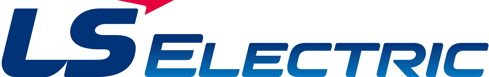

# 비전) DX팀 분석파트 🏴‍☠️
```note
## _LS Electric Co.,Ltd._
CIO&CDO / DX / Data Analysis Chapter
```
## 세미나 정보

| 회차  |    날짜     |  분류                |        내용                                             |   발표자   |
|:-----:|:----------:|:--------------------:|:-------------------------------------------------------:|:--------:|
|   1   | 2021-01-15 | ML DevOps            | Git & GitLab                                            | 창범 |
|   1   | 2021-01-15 | Programming Language | Coding Style Convention                                 | 진걸  |
|   1   | 2021-01-15 | Programming Language | Markdown                                                | 상욱   |
|   2   | 2021-01-29 | Example & etc        | 인턴 프로젝트 소개                                        | 영민   |
|   2   | 2021-01-29 | Data Visualization   | Storytelling with Data                                  | 상욱   |
|   3   | 2021-02-19 | ML Algorithm & Model | 머신러닝 모델 개발- Azure ML(Machine Learning) 사용 사례  | 진   |
|   3   | 2021-02-19 | Data Visualization   | Fundamentals of Data Visualization                      | 민선   |
|   4   | 2021-03-12 | -                    | -                                                       |    현정   |
|   4   | 2021-03-12 | -                    | -                                                       |    규본   |
|   5   | 2021-03-26 | -                    | -                                                       |    상은   |
|   5   | 2021-03-26 | -                    | -                                                       |    두성   |
|   6   | 2021-04-16 | -                    | -                                                       |    헌성   |
|   6   | 2021-04-16 | - | -                |    -   |
|   7   | 2021-04-30 | - | -                |    -   |
|   7   | 2021-04-30 | - | -                |    -   |
|   8   | 2021-05-14 | - | -                |    -   |
|   8   | 2021-05-14 | - | -                |    -   |
|   9   | 2021-05-28 | - | -                |    -   |
|   9   | 2021-05-28 | - | -                |    -   |
|   10   | 2021-06-11 | - | -                |    -   |
|   10   | 2021-06-11 | - | -                |    -   |
|   11   | 2021-06-25 | - | -                |    -   |
|   11   | 2021-06-25 | - | -                |    -   |

### 세미나 범주
1.	__ML DevOps:__ 툴 사용법, DevOps 관련 세미나  
1.	__Programming Language:__ Python, JavaScript, Sql 등 분석, ML, front, back end 에 필요한 SW언어 세미나 
1.	__ML Algorithm & Model:__ ML 논문, 알고리즘, 최신 모델 등을 소개하는 세미나 
1.	__Math / Statistics:__ 수학, 통계 세미나 
1.	__Data Visualization:__ 데이터 시각화 관련 세미나 
1.	__Example / Etc.:__ 애매한것들 
1.	__Domain:__ 전력, 자동화, 경영, 경제, 마케팅, 산업공학 최적화 등 
