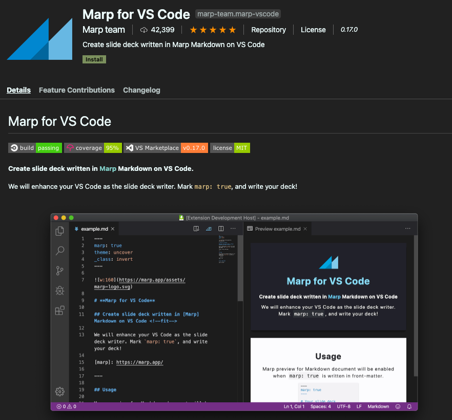
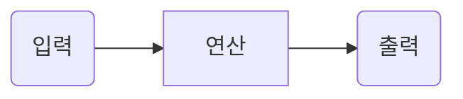
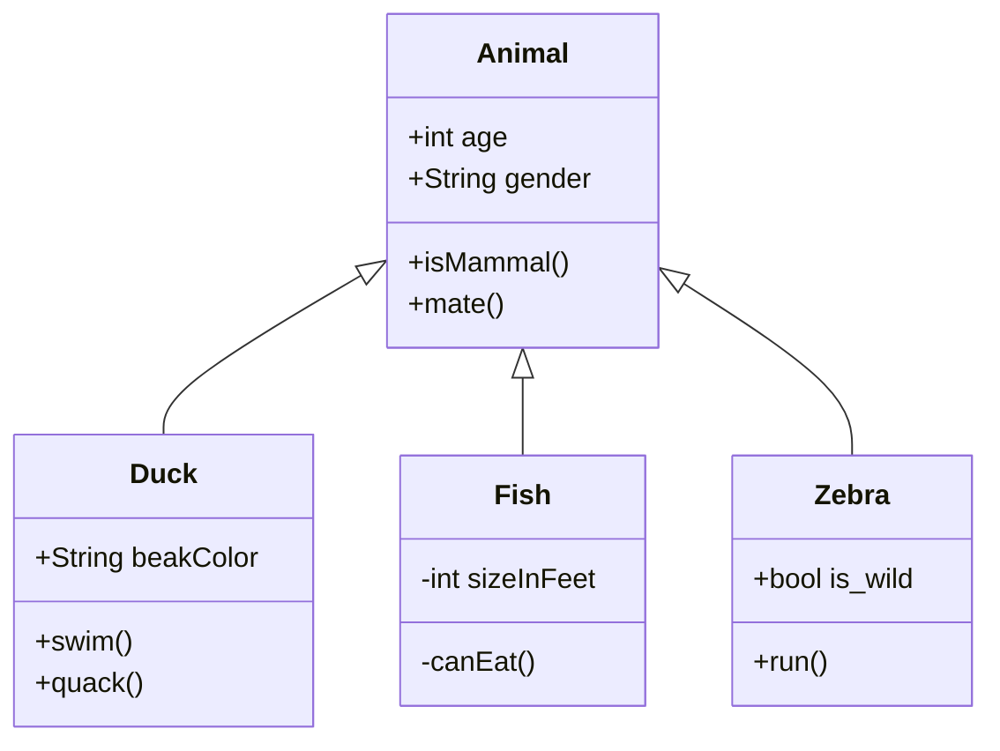
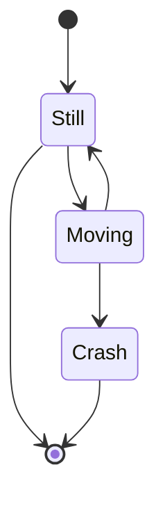

# MarkDown 사용법 

<!--Imnage-->


---

마크다운(markdown)은 일반 텍스트 기반의 경량 마크업 언어로 확장자는 **.md** 이다. 일반 텍스트로 서식이 있는 문서를 작성하는 데 사용되며, 일반 마크업 언어에 비해 문법이 쉽고 간단한 것이 특징이다. HTML과 리치 텍스트(RTF) 등 서식 문서로 쉽게 변환되기 때문에 응용 소프트웨어와 함께 배포되는 README 파일이나 온라인 게시물 등에 많이 사용된다. 문법이라고 할 것도 없으며 30분만 학습하면 사용 가능하며 *latex* 경험자라면 특별한 학습없이 바로 사용 가능할 정도로 편리하다. 

##### 마크다운의 장점

* 문법이 쉽다.
* 관리가 쉽다.
* 지원 가능한 플랫폼과 프로그램이 다양하다.
* Text로 저장 후 HTML으로의 변환이 가능하다. 변환을 지원하는 도구나 Eco(생태계)가 매우 많다.
* Text로 저장하기 때문에 Git을 통한 버전관리가 가능하고, 용량이 적어 보관이 용이하다.
* 훌륭한 커뮤니케이션 도구로써 가치가 있다.

##### 마크다운의 단점

* 유일하게 안 좋은 점이 하나 있는데 표준이 없다. 
* 핵심 문법을 제외하고는 에디터에 따라 결과물이 달라질 수 있다.

##### 마크다운의 사용

메모장부터 전용 에디터까지 많은 곳에서 활용할 수 있습니다. 문법이 쉽기 때문에 꼭 전용 에디터를 사용할 필요는 없습니다만, 마크다운 코드를 편리하게 사용하기 위해서는 VSCode, Pycharm 같은 에디터를 사용하는 것이 좋습니다.
Slack이나 Trello 같은 서비스에서 메세지를 작성하듯 사용할 수도 있습니다. (Slack이나 Trello는 도입 검토 중입니다.) 공동 작업을 위해 스타일파일(css)를 이용하면 화면 형식을 통일할 수 있습니다. 

#Level0 

1. Marp
    Marp는 VScode에서 md 파일 작성을 도와주는 익스텐션 입니다. 또한 작성된 md파일에서 ppt를 작성이 가능하도록 도와주는 툴이기도 합니다. Pycon 60% 이상의 문서가 이 Marp로 작성되고 있습니다. 
    VScode 익스텐션에서 Marp를 설치하여 사용합니다. 

    🍎*자세한 사용법은 누군가 설명*

    

1. 공용 CSS 적용 
    🍎*이부분도 누가 업데이트*
    🍎아마도 신입?


#Level1

<!--Heading-->

# Heading(머릿말)

h1 부터 h6까지 제목을 표현할 수 있습니다.

``` 

# 제목 1

## 제목 2

### 제목 3

#### 제목 4

##### 제목 5

###### 제목 6

```

<!--Emphasis-->

# Emphasis(강조)

~~~
이텔릭체는 *별표(asterisks)* 혹은 _언더바(underscore)_를 사용하세요.
두껍게는 **별표(asterisks)** 혹은 __언더바(underscore)__를 사용하세요.
**_이텔릭체_와 두껍게**를 같이 사용할 수 있습니다.
취소선은 ~~물결표시(tilde)~~를 사용하세요.
<u>밑줄</u>은 `<u></u>` 를 사용하세요.
~~~

이텔릭체는 *별표(asterisks)* 혹은 _언더바(underscore)_를 사용하세요.
두껍게는 **별표(asterisks)** 혹은 __언더바(underscore)__를 사용하세요.
**_이텔릭체_와 두껍게**를 같이 사용할 수 있습니다.
~~취소선은~~ ~~물결표시(tilde)~~ 를 사용하세요.
<u>밑줄</u>은 `<u></u>` 를 사용하세요.

<!--List-->

# 목록(List)

1. 순서가 필요한 목록
1. 순서가 필요한 목록
    - 순서가 필요하지 않은 목록(서브) 
    - 순서가 필요하지 않은 목록(서브) 
1. 순서가 필요한 목록
    1. 순서가 필요한 목록(서브)
    1. 순서가 필요한 목록(서브)
1. 순서가 필요한 목록

* 순서가 필요하지 않은 목록에 사용 가능한 기호
  + 대쉬(hyphen)
  + 별표(asterisks)
  + 더하기(plus sign)

<!--Links-->
#Links(링크)

[GOOGLE](https://google.com)

[NAVER](https://naver.com "링크 설명(title)을 작성하세요.")

[상대적 참조](../users/login)

[Dribbble][Dribbble link]

[GitHub][1]

문서 안에서 [참조 링크]를 그대로 사용할 수도 있습니다.

다음과 같이 문서 내 일반 URL이나 꺾쇠 괄호( `< >` , Angle Brackets)안의 URL은 자동으로 링크를 사용합니다.
구글 홈페이지: <https://google.com>
네이버 홈페이지: <https://naver.com>

[Dribbble link]: https://dribbble.com
[1]: https://github.com
[참조 링크]: https://naver.com "네이버로 이동합니다!"

<!--Image-->

# 이미지(Images)

을 작성하세요.")

![Giro de Italia][logo]

[logo]: https://cdn-cyclingtips.pressidium.com/wp-content/uploads/2013/05/CORVOS_00021296-044.jpg "To go Giro de Italia."


<!--Code Emphasis(코드 강조)-->
#코드(Code) 강조
백팁키를 사용합니다. "~" 혹은 "~~~"

1. 인라인(inline) 코드 강조

`background` 혹은 `background-image` 속성으로 요소에 배경 이미지를 삽입할 수 있습니다.

1. 블록(block) 코드 강조

``` html
<a href="https://www.google.co.kr/" target="_blank">GOOGLE</a>
```

``` css
.list>li {
    position: absolute;
    top: 40px;
}
```

``` javascript
function func() {
    var a = 'AAA';
    return a;
}
```

``` bash
$ vim ./~zshrc
```

``` python
s = "Python syntax highlighting"
print s
```

<!--Quote-->

# 인용문(BlockQuote)

~~~
인용문(blockQuote)

> 남의 말이나 글에서 직접 또는 간접으로 따온 문장.
> _(네이버 국어 사전)_

BREAK!

> 인용문을 작성하세요!
>> 중첩된 인용문(nested blockquote)을 만들 수 있습니다.
>>> 중중첩된 인용문 1
>>> 중중첩된 인용문 2
>>> 중중첩된 인용문 3

~~~
인용문(blockQuote)

> 남의 말이나 글에서 직접 또는 간접으로 따온 문장.
> _(네이버 국어 사전)_

BREAK!

> 인용문을 작성하세요!
>> 중첩된 인용문(nested blockquote)을 만들 수 있습니다.
>>> 중중첩된 인용문 1
>>> 중중첩된 인용문 2
>>> 중중첩된 인용문 3

<!--Horizontal-->
#수평선(Horizontal Rule)

~~~
---
(Hyphens)

***
(Asterisks)

___
(Underscores)
~~~
---
(Hyphens)

***
(Asterisks)

___
(Underscores)

<!--Line Breaks-->
#줄바꿈(Line Breaks)
~~~
동해물과 백두산이 마르고 닳도록 
하느님이 보우하사 우리나라 만세   <!--띄어쓰기 2번-->
무궁화 삼천리 화려 강산<br>
대한 사람 대한으로 길이 보전하세
~~~

동해물과 백두산이 마르고 닳도록 
하느님이 보우하사 우리나라 만세   <!--띄어쓰기 2번-->
무궁화 삼천리 화려 강산<br>
대한 사람 대한으로 길이 보전하세

# Level2

<!--Table-->
#표(Table)
markdown table 작성 참고 사이트 
[Table Generator](https://www.tablesgenerator.com/markdown_tables)

~~~
| 값 | 의미 | 기본값 |
|---|:---:|---:|   
| `static` | 유형(기준) 없음 / 배치 불가능 | `static` |
| `relative` | 요소 자신을 기준으로 배치 |  |
| `absolute` | 위치 상 부모(조상)요소를 기준으로 배치 |  |
| `fixed` | 브라우저 창을 기준으로 배치 |  |

|---|  정렬 없음 
|:---:| 중앙 정렬
|---:| 오른쪽 정렬
|:---| 왼쪽 정렬

| 값          |              의미              |      기본값 |
|------------|:----------------------------:|---------:|
| `static` |      유형(기준) 없음 / 배치 불가능      | `static` |
| `relative` |      요소 **자신**을 기준으로 배치      |          |
| `absolute` | 위치 상 **_부모_(조상)요소**를 기준으로 배치 |          |
| `fixed` |      **브라우저 창**을 기준으로 배치     |          |

~~~

| 값 | 의미 | 기본값 |
|---|:---:|---:|
| `static` | 유형(기준) 없음 / 배치 불가능 | `static` |
| `relative` | 요소 자신을 기준으로 배치 |  |
| `absolute` | 위치 상 부모(조상)요소를 기준으로 배치 |  |
| `fixed` | 브라우저 창을 기준으로 배치 |  |

| 값          |              의미              |      기본값 |
|------------|:----------------------------:|---------:|
| `static` |      유형(기준) 없음 / 배치 불가능      | `static` |
| `relative` |      요소 **자신**을 기준으로 배치      |          |
| `absolute` | 위치 상 **_부모_(조상)요소**를 기준으로 배치 |          |
| `fixed` |      **브라우저 창**을 기준으로 배치     |          |

<!--Equation-->
#수식 
*Latex* 문법 동일 
[Latex Euation](https://latex.codecogs.com/eqneditor/editor.php)
[Latex Equation reference](https://www.overleaf.com/learn/latex/mathematical_expressions)

~~~
$$f(x)= if x < x_{min} : (x/x_{min})^a$$  
$$otherwise : 0$$  
$$P(w)=U(x/2)(7/5)/Z$$  
$$p_{\theta}(x) = \int p_{\theta}(2z)p_{\theta}(y\mid k)dz$$  
$$x = argmax_k((x_t-x_u+x_v)^T*x_m)/(||x_b-x_k+x_l||)$$  
~~~

$$f(x)= if x < x_{min} : (x/x_{min})^a$$  
$$otherwise : 0$$  
$$P(w)=U(x/2)(7/5)/Z$$  
$$p_{\theta}(x) = \int p_{\theta}(2z)p_{\theta}(y\mid k)dz$$  
$$x = argmax_k((x_t-x_u+x_v)^T*x_m)/(||x_b-x_k+x_l||)$$  

<!-- UML-->

# UML 다이어그램

순서도, 흐름도 등을 표현할 때 유용하다.

[sequence-diagrams](https://bramp.github.io/js-sequence-diagrams/)



# Sequence

``` sequence
Alice->Bob: Hello Bob, how are you?
Note right of Bob: Bob thinks
Bob-->Alice: I am good thanks!
```

# FlowChart

``` flow
st=>start: Start
op=>operation: Your Operation
cond=>condition: Yes or No?
e=>end

st->op->cond
cond(yes)->e
cond(no)->op
```

# ClassDiagram



# StateDiagram 




