# Git 세미나
_Last Updated: 2021-01-13_

## 목차 🧭
- 개요
- 0 단계
- 1 단계
- 2 단계
- 3 단계

---

## 개요 🐶


<br>


### 숙련도에 따른 단계 분류 🎯

>- __0 단계:__ Git, GitLab이 뭔지 모른다.
>- __1 단계:__ master branch에서 commit과 push만 할 줄 안다.
>- __2 단계:__ branch와 merge를 사용하고 rollback할 줄 안다.
>- __3 단계:__ 동작원리를 이해하며 고급 명령어를 사용하여 version history를 조작한다.

<br>

### 실습 흐름도
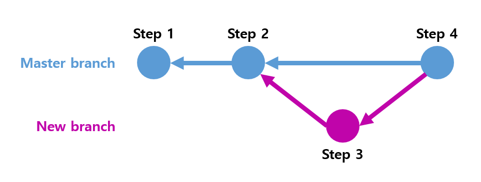

---

## 0 단계
>_Git, GitLab이 무엇인지 모른다._

### Git이 무엇인가요?
분산형 버전 관리 시스템 👨‍🏫

_효과적인 코드 관리_


<br>


>2005년 리눅스 커널 개발중 Git 개발
>
>- Linus Torvalds (Finland)


모든 노드의 모든 git 디렉터리는 네트워크 접속이나 중앙 서버와는 __독립적__ 으로 동작하는 완전한 __이력/버전 추적 기능__ 을 갖춘 성숙한 저장소이다.

>- __협업 시 편한 형상 관리__
>   - 다수 인원 동시 개발
>   - 특정 버전 rollback
>   - 변경 이력 확인
>   - 개발자간 편집 내용 충돌 시 알림

### GitLab은 무엇인가요?


GitLab은 2014년 개발된 __웹 기반 Git 저장소 관리자__ 및 __DevOps 수명주기 도구__ 입니다.

>- __개발자들의 버전 제어 및 공동 작업을 위한 플랫폼__
>   - Git을 사용하는 프로젝트를 지원하는 웹호스팅 서비스
>   - Git을 업로드 할 수 있는 웹사이트
>   - 칸반보드, Wiki, Issue tracking, CI/CD 파이프 라인 기능 제공
>   - Github, Bitbucket, Azure Repos과 동일한 서비스 (변경 가능성)

---

### 실습 (Step 1)
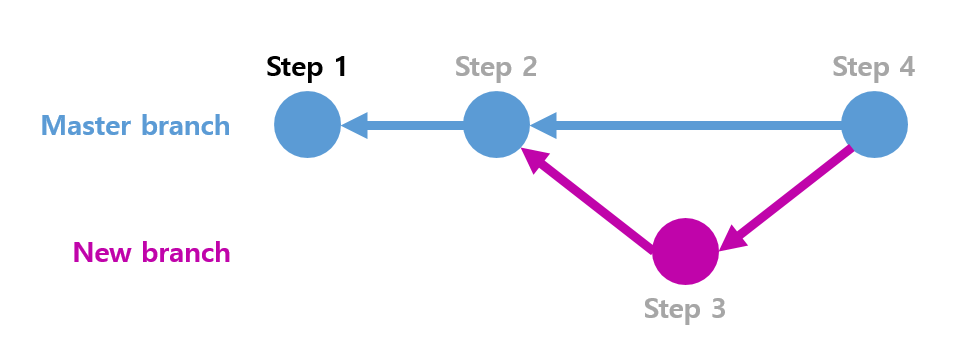

__실습목표:__
- GitLab의 remote repository를 local repository에 clone 수행

>1. Git 설치
>2. 환경 설정
>3. Clone 수행

#### 1. Git 설치
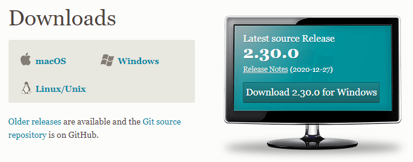

- [Git 다운로드 링크](https://git-scm.com/downloads)에서 OS환경따라 파일 다운로드 및 설치

#### 2. 환경 설정
>- 사용자 이름
>- 사용자 이메일
>- 인증서 설정

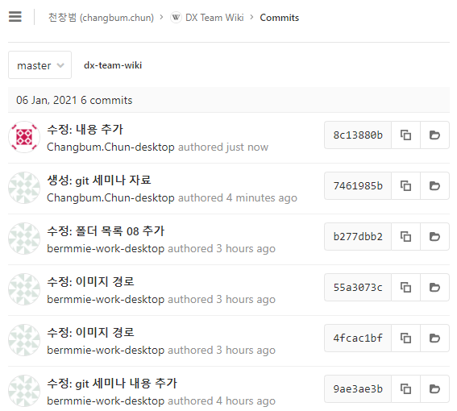

##### 사용자 이름 설정
- commit 메세지에 기재 되는 사용자 명


```git
# "이름.성"이 포함된 자유형식
$ git config --global user.name "Changbum.Chun-desktop"
$ git config --global user.name "Gyubon.Hwang-macbook"
$ git config --global user.name "Jingeol.Ryu"
```

##### 사용자 이메일 설정
- commit에 연결된 이메일 주소


```git
# 연락 받을 이메일 주소
$ git config --global user.email "cbchun@ls-electric.com"
$ git config --global user.email "bermmie1000@gmail.com"
```

##### 인증서 설정
SSL 인증서 설정
```git
$ git config --global http.sslVerify false
```

#### 3. 클론
>##### Clone이 뭔데요?
>
>- ~~1996년도에 데뷔한 2인조 댄스가수 (멤버: 강원래, 구준엽)~~
>- Clone은 remote repository(원격 저장소)의 내용을 통째로 다운로드하는 것을 말합니다.
>- Clone한 repository를 다른 PC에서 local repository로 사용할 수 있게 됩니다.

>##### Repository가 뭔데요?
>
>- Repository(저장소)란 말그대로 파일이나 폴더를 저장해 두는 곳입니다.
>- 그런데 Git repository가 제공하는 좋은 점 중 하나는 파일이 변경 이력 별로 구분되어 저장된다는 점입니다.
>- 비슷한 파일이라도 실제 내용 일부 문구가 서로 다르면 다른 파일로 인식하기 때문에 파일을 변경 사항 별로 구분해 저장할 수 있습니다.

>##### Remote와 Local의 차이는 무엇인가요?
>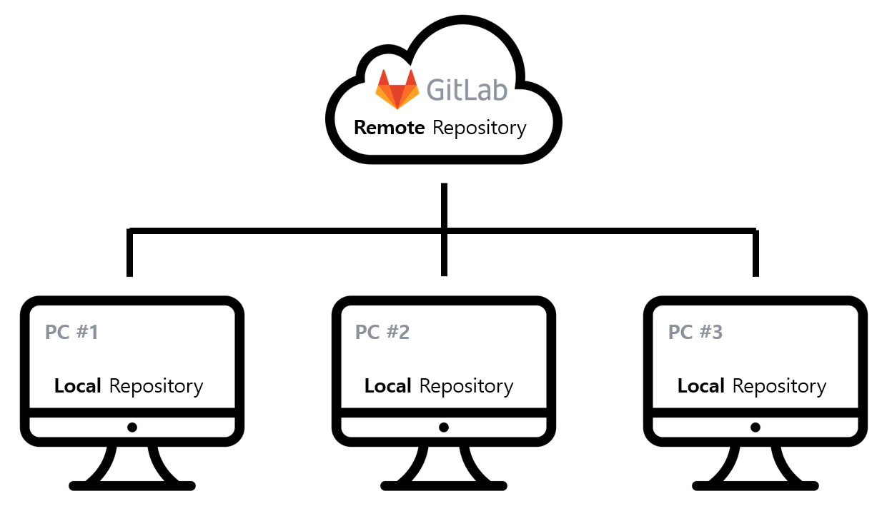
>- __Remote Repository__(원격 저장소): 파일이 서버에서 관리되며 여러 사람이 함께 공유하기 위한 repository입니다.
>- __Local Repository__(로컬 저장소): 내 PC에 파일이 저장되는 개인 전용 repository입니다.

---

##### Clone 수행
1. 타겟 repository 주소 획득
    - Remote Repository의 [주소](https://git.lsis.com/dx-team/temporary)는 GitLab에서 확인할 수 있습니다.

    


2. Console 명령어 입력

    - 원하는 디렉토리 이동 후 clone 명령어를 사용하여 GitLab의 remote repository를 clone합니다.
    ```git
    # Clone remote repository with HTTPS
    $ cd "your directory"
    $ git clone https://git.lsis.com/dx-team/temporary.git
    ```
    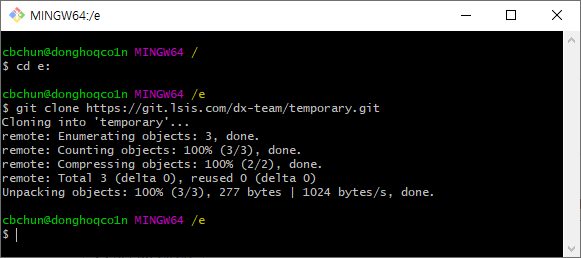


---
## 1 단계
>_master branch에서 commit과 push만 할 줄 안다._

### 실습 (Step 2)
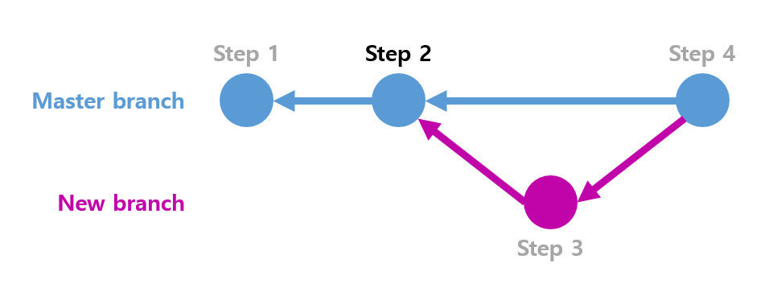
__실습목표:__
- Master branch에서 commit과 push 수행하기

>1. README.md 파일 수정
>2. add
>3. commit
>4. push

---

#### 1. README.md 파일 수정
- Master branch의 Working directory에 있는 __README.md 파일을 수정__ 한다.

##### Master branch가 뭔가요?


- repository를 처음 만들면, Git은 바로 'master'라는 이름의 branch를 만들어 둡니다. 이 새로운 repository에 새로운 파일을 추가 한다거나 추가한 파일의 내용을 변경하여 그 내용을 저장(커밋, Commit)하는 것은 모두 'master' 라는 이름의 branch를 통해 처리할 수 있는 일이 됩니다.

- 'master'가 아닌 또 다른 새로운 branch를 만들어서 '이제부터 이 branch를 사용할거야!'라고 선언(체크아웃, checkout)하지 않는 이상, 이 때의 모든 작업은 'master' branch에서 이루어 집니다.

---

##### Working directory와 Staging area가 무엇인가요?

- __Working Directory:__ 작업을 진행 중인 directory
- __Staging Area:__ Working directory에서 변경된 정보를 저장하는 공간, repository로 commit하기 전 공간
- __쇼핑몰 비유:__
    - Working directory: 쇼핑 공간
    - add: 장바구니에 담기
    - Staging area: 장바구니
    - commit: 구매하다
    - Repository: 최종 구매내역
    - log: 구매 히스토리

---

#### 2. add
- 수정된 README.md 파일을 Staging area로 add한다.


```git
# Local repository로 이동
$ cd temporary
# "."으로 현재 디렉토리 전체 선택
$ git add .
```

---

#### 3. commit
- 변경된 이력을 Local repository에 commit한다.

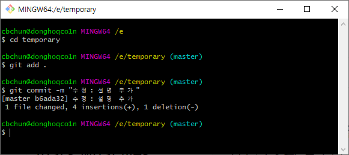

```git
# "-m" 옵션을 사용해 한 줄 commit 메시지 작성
# commit 메시지는 "동사: 설명"으로 작성한다.
$ git commit -m "수정: 창범 생일 추가"
```

- 원활한 협업을 위한 commit 메시지 [컨벤션](https://git.lsis.com/cbchun/dx-team-wiki/blob/master/02_Git/Convention.md)이 존재한다.

---

#### 4. push
- Remote repository에 push한다.

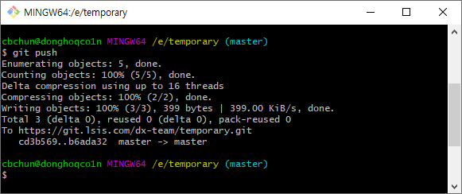

```git
# Local repository의 내용을 remote repository로 업로드한다.
$ git push
```

- 충돌 발생


#### 5. 병합


##### pull
- branch의 정보를 당겨온다.

```git
# 현재 branch pull
$ git pull

# 다른 branch pull할 시 origin을 붙여야 함
$ git pull origin "branch"
```


---

##### fetch + diff
- fetch는 remote repository의 정보를 local로 받아온다.
- diff는 받아온 정보를 바탕으로 특정 branch와의 차이점을 출력한다.

```git
$ git fetch
$ git diff "branch"
```
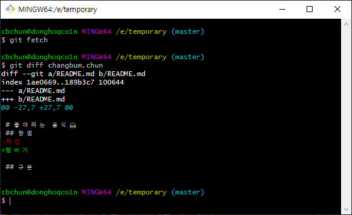

##### merge
- fetch로 알게된 정보를 바탕으로 수동 병합한다.

```git
$ git merge "branch"
```

- VSCode를 사용중이면 Conflict가 발생한 지점에 선택지가 나타난다.

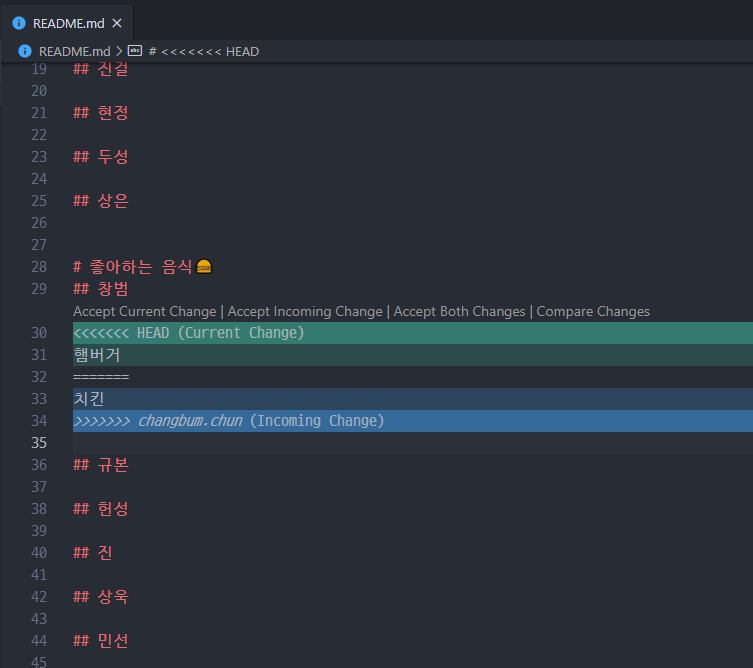

- Conflict 처리 후 commit 하면 해소된다.
```git
# conflict resolve
$ git add .
$ git commit -m "행동: 설명"
$ git push
```


---
## 2 단계
>_branch와 merge를 사용하고, checkout으로 rollback을 사용한다._

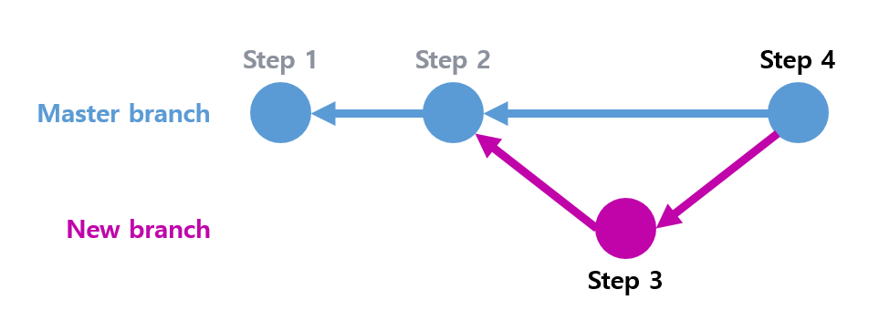

__실습 목표:__
- 새로운 branch로 checkout하여 파일을 수정하고 push한다.

>1. New branch 생성 및 이동
>2. 파일 수정 및 push
>3. Master branch에서 New branch 병합


---

### 실습 (Step 3 & 4)
#### 1. New branch 생성 및 이동
- 새로운 branch로 checkout하여 파일을 수정하고 push한다.
>##### Branch가 무엇인가요?
>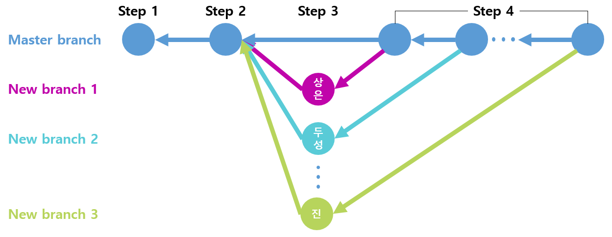
>- branch란 독립적으로 어떤 작업을 진행하기 위한 개념입니다.
>- 필요에 의해 만들어지는 각각의 branch는 다른 branch의 영향을 받지 않기 때문에, __여러 작업을 동시에 진행할 수 있습니다__.

- New branch 생성

```git
# 컨벤션에 따라 branch 생성
$ git branch changbum.chun
```


- New branch로 이동

```git
$ git checkout "New branch"
```


#### 2. 파일 수정 및 push

```git
$ git add .
# commit 메세지 컨벤션 -> "행동: 설명"
$ git commit -m "수정: 창범 생일 추가"
$ git push

# 최초 upstream 생성
fatal: The current branch changbum.chun has no upstream branch.
To push the current branch and set the remote as upstream, use

    git push --set-upstream origin changbum.chun

#
$ git push --set-upstream origin changbum.chun
```

---

### 실습 (Hidden Step)
- 과거 commit 지점으로 rollback한다.
>1. New branch에서 파일 수정 및 push
>2. 과거 버전으로 rollback

#### 1. New branch에서 파일 수정 및 push
- new branch의 log를 참고하여 commit 번호를 확인한다.
```git
$ git checkout "New branch"
$ git log
```

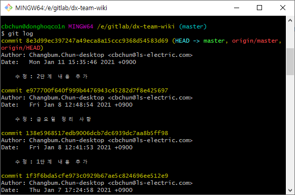

- gitLab에서도 확인할 수 있다

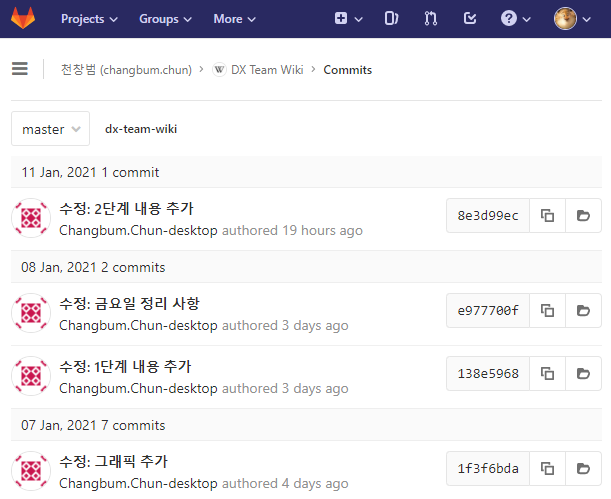

#### 2. 과거 버전으로 rollback
- log에서 확인한 과거 버전 commit 번호를 기반으로 rollback을 수행한다.

```git
$ git checkout "commit 8-digit"

# 최신버전으로 다시 돌아가는 법
$ git switch -
# 또는 최신버전 commit 번호로 checkout
```

---
# 3 단계
>_동작원리를 이해하며 고급 명령어를 사용하여 version history를 조작한다._

---
