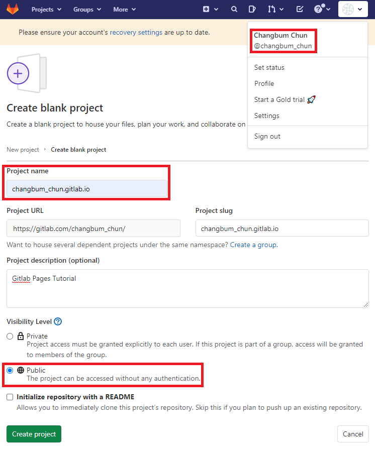
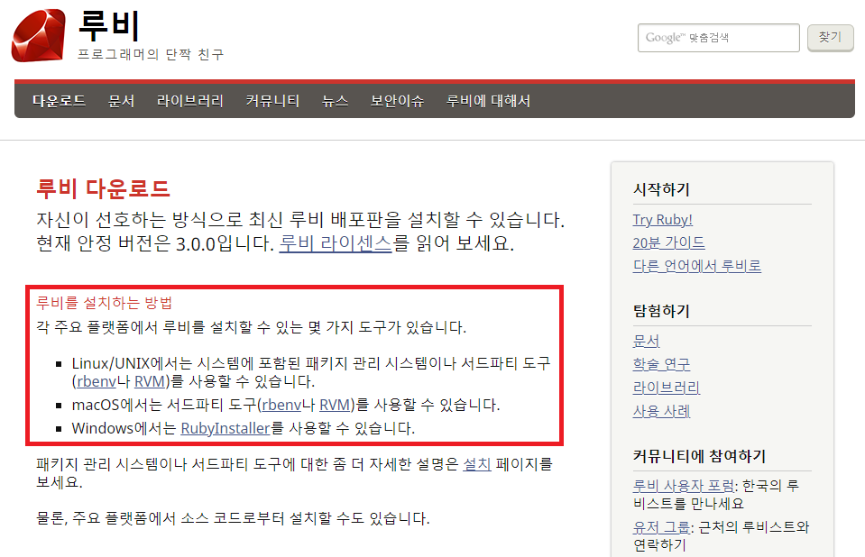
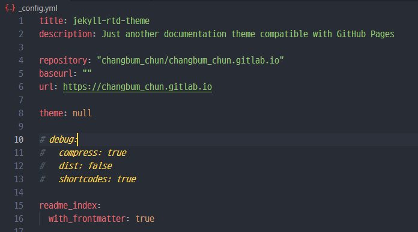
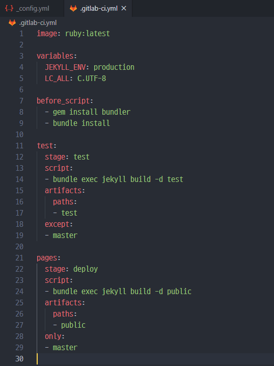
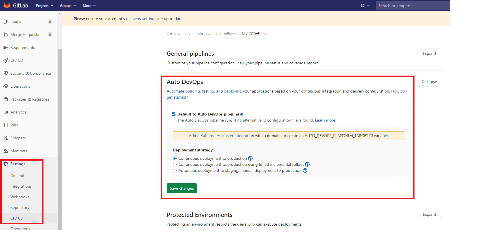
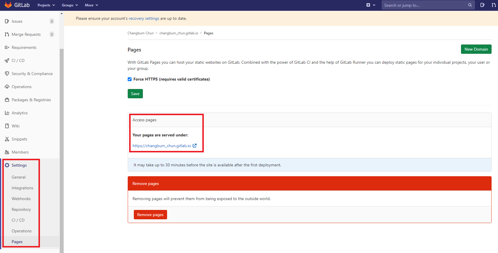
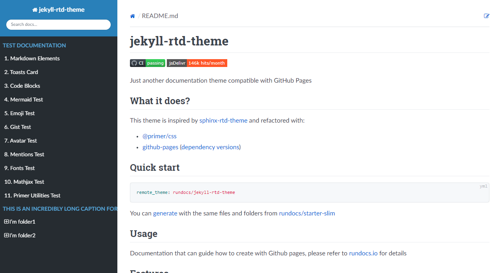

# GitLab Pages Tutorial 😎
- _*본 문서는 Windows10 환경 기반으로 작성 되었습니다._
- _**에디터는 VSCode가 사용 되었습니다._
- _*** 아래 내용을 잘 숙지한다면 `GitHub`에서도 응용하여 사용할 수 있습니다._

## 0. 목차 🧭
1. 프로젝트 생성
1. `Jekyll` template 적용
1. `Ruby` 환경 설정
1. 호스팅 설정
1. Template 수정


## 1. 프로젝트 생성
### 새로운 프로젝트 만들기
- 웹페이지를 호스팅 해줄 `GitLab` (혹은 `GitHub`)에서 Project(Remote repository)를 생성한다.

### 프로젝트 환경 설정


- Project name의 형식은 "userName.gitlab.io"으로 작성한다.
    - 나의 경우 __userName__ 은 위 그림 중 오른쪽 상단에 표시된 것 처럼 __@changbum_chun__ 이다.
    - 형식 위반 시 URL이 지저분 해진다.
- Repository의 Visibility Level은 원하는 상태로 설정한다.
    - 우리가 호스팅할 `Pages`와 지금 설정하는 Visibility Level은 별개이다.
    - `GitLab`의 경우 `Pages`의 Accessibility는 생성 완료 후 사이드바 > Settings > General > Visibility, project features, permissions > Pages에서 설정할 수 있다.
    - 하지만 `GitHub`의 경우는 Enterprise 등급부터 Accessibility를 설정할 수 있다.

### 로컬 환경으로 clone


- 생성한 Remote repository를 로컬의 원하는 디렉토리에 clone한다.

```git
$ cd "디렉토리"
$ git clone "Repository"
```


## 2. `Jekyll` template 적용
- 이 튜토리얼에선 [Jekyll](http://jekyllrb-ko.github.io)이란 정적 사이트 생성기를 사용하여 웹페이지를 제작한다.
- 이미 세상엔 `Jekyll`로 만들어진 멋진 템플렛들이 많고 [Jekyll Themes](http://jekyllthemes.org/)에서 둘러볼 수 있다.

### 템플렛 선택


- 우리는 이 예제에서 위 그림과 같은 [jekyll-rtd-theme](http://jekyllthemes.org/themes/jekyll-rtd-theme/)을 사용한다.
    - 해당 테마는 [sphinx](https://www.sphinx-doc.org/en/master/)로부터 영감 받아 탄생했다.

### 템플렛 받아오기
- 원하는 템플렛을 받아오는 방법은 두가지가 있다.
    - 직접 [다운](https://github.com/rundocs/jekyll-rtd-theme/zipball/master) 받는 방법과
    - 템플렛의 repository를 로컬로 [clone](https://github.com/rundocs/jekyll-rtd-theme)하는 방법


- 💡중요한 것은 __템플렛의 내용물을__ 위에서 우리가 생성하고 clone한 __로컬 repository에 위치 시키는 것__ 이다.

## 3. `Ruby` 환경 설정 💎
```note
# 💡 __`GitHub` Only__
- `GitLab`을 사용해서 튜토리얼을 진행중이라면 __3. Ruby 환경 설정 💎__ 부분은 건너 뛰고 __4. 호스팅 설정__ 으로 가면 된다.
- `GitLab`은 해당 내용이 기재된 `*.yml`파일을 업로드하여 CI 작업마다 서버에 환경을 설치하기 때문이다.
```

- `Jekyll`은 [Ruby](https://www.ruby-lang.org/ko/) 언어로 작성 되었다.

### `Ruby` 다운로드


- [Ruby 다운로드 링크](https://www.ruby-lang.org/ko/downloads/)에서 파일을 받아 설치해야 한다.
    - 설치하는 위치는 중요하지 않다.
    - 설치 중 복잡한 세부 사항은, 늘 그렇듯, 다음을 눌러 완료한다.

- `Ruby` 설치를 완료 했다면 콘솔창에서 아래 명령어로 `Ruby`가 정상 작동을 하는지 버전을 확인한다.

```console
# Ruby 설치/버전 확인
$ ruby -v
```
### `Jekyll` bundler 설치

- `Ruby`가 제대로 작동한다면 아래와 같이 콘솔창에서 gem을 사용해 jekyll bundler를 설치한다.
    - gem은 RubyGems의 줄임이고 `Ruby`의 package manager이다.
    - bundler는 `Ruby`프로젝트에 필요한 gem들의 올바른 버전을 추적하고 설치해서 일관된 환경을 제공한다.

```console
$ gem install jekyll bundler
```

- 이어서, local repository 디렉토리에서 bundle을 설치한다.

```console
$ cd "local repository"
$ bundle install
```


## 4. 호스팅 설정
- 내가 원하는대로 커스터마이즈를 하기 전에, 먼저, 적용한 __템플릿을 배포하고 그 템플릿의 기본 구조를 확인해보자.__
- 위에서 받은 `jekyll` 템플릿 덕에 대부분의 설정은 완료 되어 있다.
- 하지만 배포하기전 __수정해야할 파일__ 과 __생성해야할 파일__ 이 있다.

### 파일 수정: `_config.yml`


- `GitLab`의 경우
    - `_config.yml` 파일에서 repository, baseurl, url 세가지를 추가한다.

    ```yml
    repository: "userId/userId.gitlab.io"
    baseurl: ""
    url: https://userId.gitlab.io
    ```
- `GitHub`의 경우
    - `_config.yml` 파일에서 baseurl, url 두가지를 추가한다.

    ```yml
    baseurl: ""
    url: https://userId.gitlab.io
    ```

### 파일 생성: `.gitlab-ci.yml`
```note
# 💡 __`GitLab` Only__
- `Github`를 사용한다면 건너 뛰어도 되는 내용이다.
- 사실 왜인지는 자세히 모르겠지만 `GitLab`에서는 CI를 위해 `runner`가 읽고 실행할 `*.yml`파일을 별도로 생성해주어야한다.
```



- 아래 code block에서 복붙한 `.gitlab-ci.yml` 이름의 파일을 같은 디렉토리 내에 생성한다. [출처](https://gitlab.com/pages/jekyll/-/blob/master/.gitlab-ci.yml)

```yml
image: ruby:latest

variables:
  JEKYLL_ENV: production
  LC_ALL: C.UTF-8

before_script:
  - gem install bundler
  - bundle install

test:
  stage: test
  script:
  - bundle exec jekyll build -d test
  artifacts:
    paths:
    - test
  except:
  - master

pages:
  stage: deploy
  script:
  - bundle exec jekyll build -d public
  artifacts:
    paths:
    - public
  only:
  - master
```

### CI 설정하기
- 우리가 로컬에서 push하여 repository를 업데이트하면 똑똑한 `GitLab`(혹은 `GitHub`)은 CI pipeline을 통해 스스로 변경 사항을 새로 호스팅한다.
- 이를 `Auto DevOps`라 하는데 설정이 되어 있지 않은 경우 아래 그림처럼 사이드 바의 Settings 메뉴 중 CI/CD에서 __Default to Auto DevOps pipeline의 체크박스를 체크__ 해야 한다.
- `GitHub`의 경우 기본으로 체크되어있기 때문에 별도로 설정하기 않아도 된다.



### Pages 배포하기
- 위의 순서를 잘 진행 했다면 Local repository의 변경 사항을 add, commit, push 하면 된다.



- 이후 CI의 pipeline에서 작업이 끝나길 기다린 후(약 3분) Setting의 Pages에서 url를 클릭하면 우리가 만든 웹페이지로 새 창 이동한다.
    - `GitLab`의 경우 pipeline의 작업 진행 상황은 사이드 바의 CI/CD 탭에서 관찰할 수 있다.

### 짜잔!
- 웹페이지 배포 성공


## 5. Template 수정
### 대문
#### Title
- 가장 먼저 웹사이트의 제목을 변경하자


- 사이트의 제목과
제목 위에 마우스 커서를 올려놓으면 뜨는 설명은
`_config.yml`파일에서 수정한다.


#### 홈 화면
- 우리가 사용하는 템플릿은 `*.md`을 기반으로 게시물을 작성한다.
- 사이트 접속 시 처음에 뜨는 홈 화면은 프로젝트 폴더 가장 상위(root)에 위치한 `README.md` 파일을 수정하면 된다.

#### 게시물
- 작성한 `*.md`파일을 게시하기 위해선 두가지 폴더만 알고 있으면 된다.
  - 게시할 `*.md`파일 저장 폴더인 `root > assets > images`와
  - `*.md`파일에 사용할 이미지 파일 저장 폴더인 `root > test`
  - `test_long`을 사용하면 사이드바를 폴더 형식으로 사용할 수 있다.


```console
# 템플렛의 폴더 구조
root
├─.github
│  ├─ISSUE_TEMPLATE
│  └─workflows
├─assets
│  ├─css
│  │  └─fonts
│  ├─images <--------------------------- 이미지 파일 저장
│  └─js
├─test <-------------------------------- *.md 파일 저장
├─test_long <--------------------------- *.md 파일 폴더 형식 저장
│  ├─folder1
│  │  └─folder2
│  │      └─folder1
│  └─folder2
│      └─folder1
├─_includes
│  ├─common
│  │  ├─assets
│  │  ├─core
│  │  └─rest
│  ├─extra
│  ├─rest
│  ├─shortcodes
│  └─templates
├─_layouts
│  └─tasks
└─_sass
    ├─core
    └─lib
        ├─@primer
        │  └─css
        │      ├─base
        │      ├─breadcrumb
        │      ├─buttons
        │      ├─forms
        │      ├─loaders
        │      ├─markdown
        │      ├─support
        │      │  ├─mixins
        │      │  └─variables
        │      └─utilities
        ├─font-awesome
        ├─material-design-lite
        └─rouge
```

# 끝 🤞